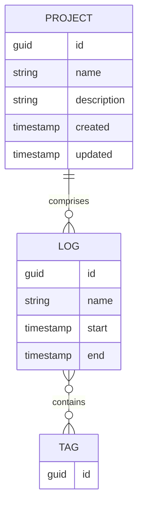

```mermaid
erDiagram
    PROJECT ||--o{ LOG : comprises
    PROJECT {
        guid id
        string name
        string description
        timestamp created
        timestamp updated
    }
    LOG }o--o{ TAG : contains
    LOG {
        guid id
        string name
        timestamp start
        timestamp end
    }
    TAG {
        guid id

    }
```